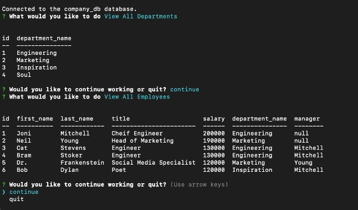
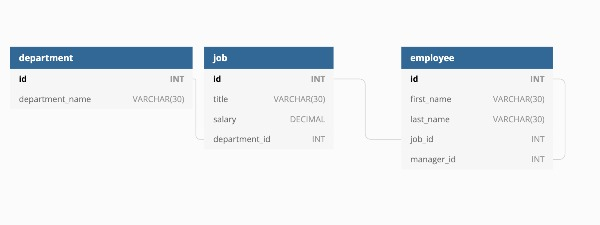

# Employee Tracker
## Lauren Darrimon
    
    
### Description
A command line application to manage a company employee database through MySQL, Node.js, Inquirer, and Console Table. 

### Table of Contents

* [Link](#link)
* [Installation](#installation)
* [Usage](#usage)
* [Contributing](#contributing)
* [Questions](#questions)
* [License](#license)

### Link 
🔗 
Link to application's code repository: [Employee Tracker](https://laurendarrimon.github.io/employee-tracker/)

### Installation
🔧
In order for this application to work, you need to install the following (dependencies): 
Node.js, MySQL, the Node module, Inquirer, and Console Table.  Once you have Node.js and MySQL, run the following command from the root directory to install Inquirer and Console Table: 

~~~
npm install 
~~~

### Usage 

Navigate to the db/ directory to set up and seed the database.  This will create tables in your data base as shown below. 

~~~
mysql -u root -p
source schema.sql
source seeds.sql
~~~

.

To run the application from the command line, return to the root directory: 

~~~
npm start
~~~

Then, follow the user prompts and menus through the application, as shown [in this walkthrough video](https://drive.google.com/file/d/1Vn8qr97kqSUNUlX1np-QcOWkOUALsF06/view?usp=sharing).

### Contributing 
✍️ 
Lauren Darrimon is the author of this application. Find additional work on Lauren Darrimon's [Github profile.](http://github.com/laurenDarrimon). 

### Questions
❓💌
Reach out to Lauren Darrimon at hello@laurenlalita.com if you have any questions. 

### License
The license for this project is: [MIT](https://opensource.org/licenses/MIT)

